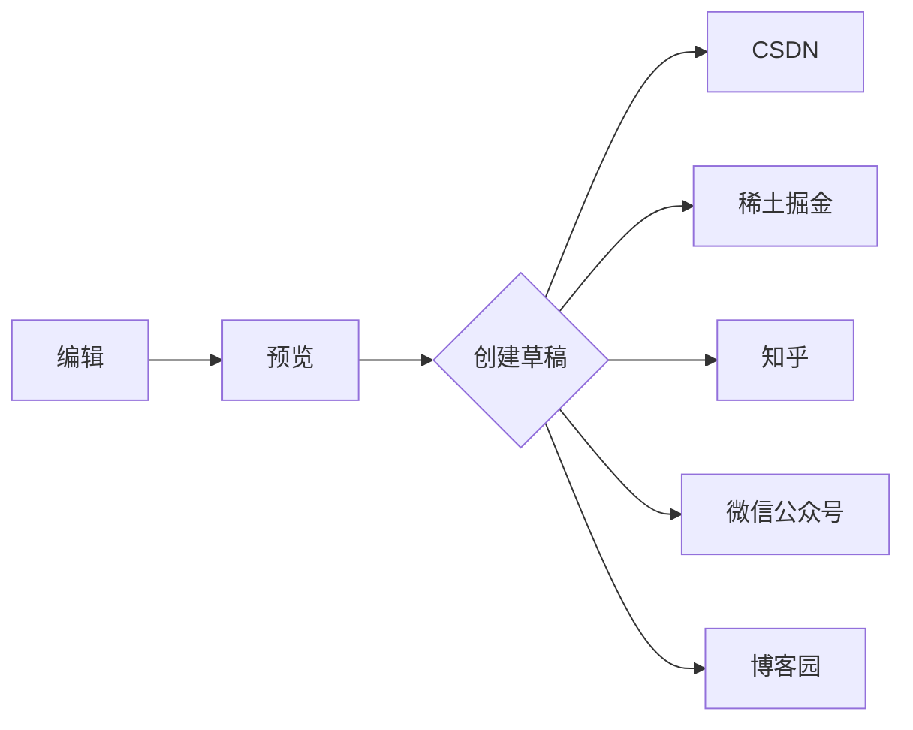

# WenDispatch 跨平台验证文章

这是一篇仅用于草稿验证的文章。正文包含中文、English、数字 123 和特殊字符：`<>&\"'`。

## 基础排版

普通段落包含**粗体**、*斜体*、~~删除线~~和 `inline code`。

> 这是一段引用。
>
> 引用中的第二段应保持在同一个引用块内。

- 无序列表第一项
- 无序列表第二项
  - 嵌套列表

1. 有序列表第一项
2. 有序列表第二项

- [x] 已完成任务
- [ ] 未完成任务

---

### 链接与图片

普通链接：[WenDispatch](https://github.com/SWHL/WenDispatch?from=validation#readme)。

外链图片：


[](https://github.com/SWHL/WenDispatch)

本地图片验证点：导入后在本段下方粘贴一张名为 `中文图片.png` 的图片，并确认五个平台均未显示 `local://` 地址。

#### 代码

```typescript
type PublishResult = {
  platform: 'csdn' | 'juejin' | 'zhihu' | 'wechat' | 'cnblogs';
  success: boolean;
};

const escapeHtml = (value: string) =>
  value.replace(/[<>&]/g, char => ({ '<': '&lt;', '>': '&gt;', '&': '&amp;' })[char]!);
```

```bash
pnpm --filter @wendispatch/extension build:fast
```

##### 数学公式

行内公式：$E = mc^2$。

块公式：

$$
\sum_{i=1}^{n} i = \frac{n(n+1)}{2}
$$

###### Mermaid



## 表格

| 字段 | 值 | 说明 |
| --- | ---: | --- |
| 平台数 | 5 | 第一阶段 |
| 模式 | 草稿 | 不公开发布 |

验证结束标记：`WENDISPATCH_VALIDATION_END`

